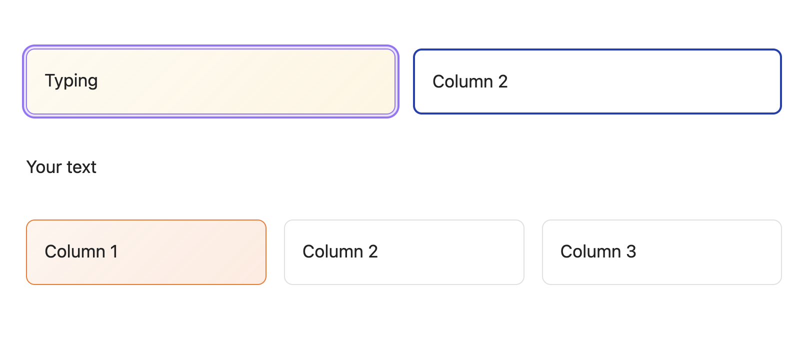
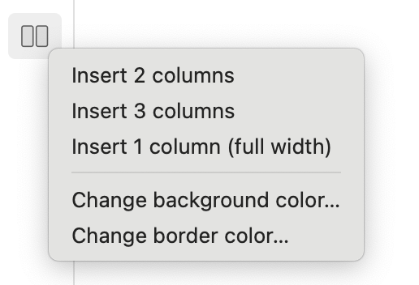

# Obsidian Live Columns

Live Columns allows you to create multi-column layouts visually. Lets you insert, edit, and style columns directly in the Live Preview mode. 

## Key Features

* **Editing:** Create columns and write content directly within the Live Preview view. No need to switch to Source Mode or deal with messy code blocks.
* **Flexible Layouts:** Quickly insert 2 columns, 3 columns, or full-width (1 column) sections.
* **Customizable Styles:** Change **Background/Border Colors** for each column.

## How to Use

After installing, simply click the plugin icon located in the **left ribbon** (the sidebar on the left).

## Contributing

Contributions are welcome! If you have ideas for new features or find bugs, please open an issue or submit a pull request.

## License

MIT
